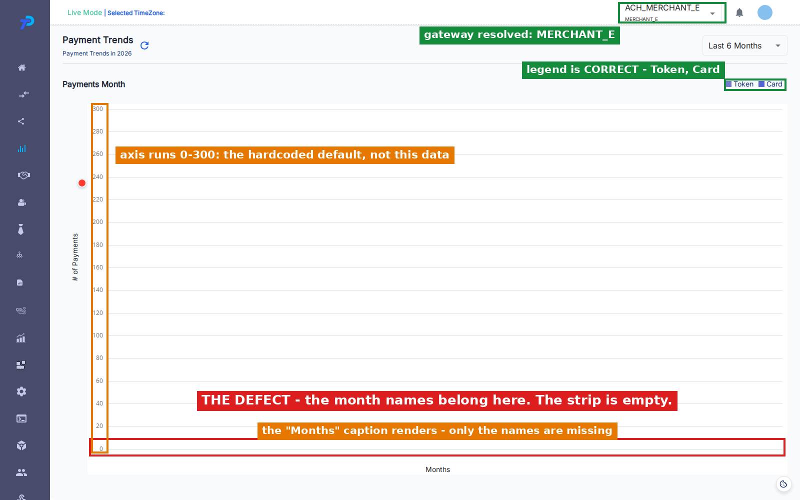
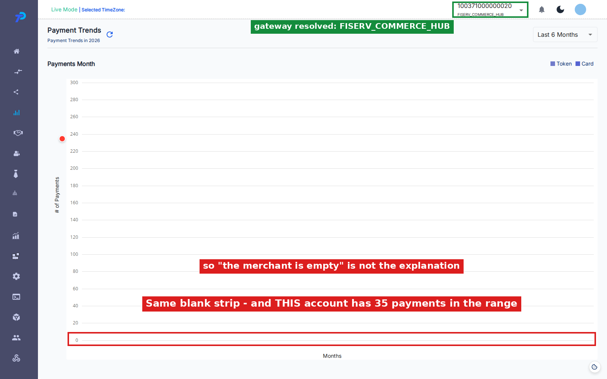
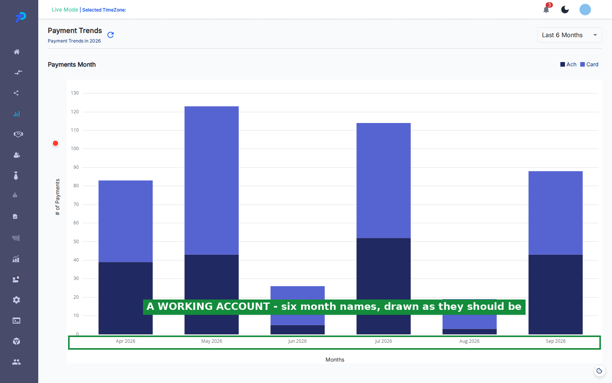
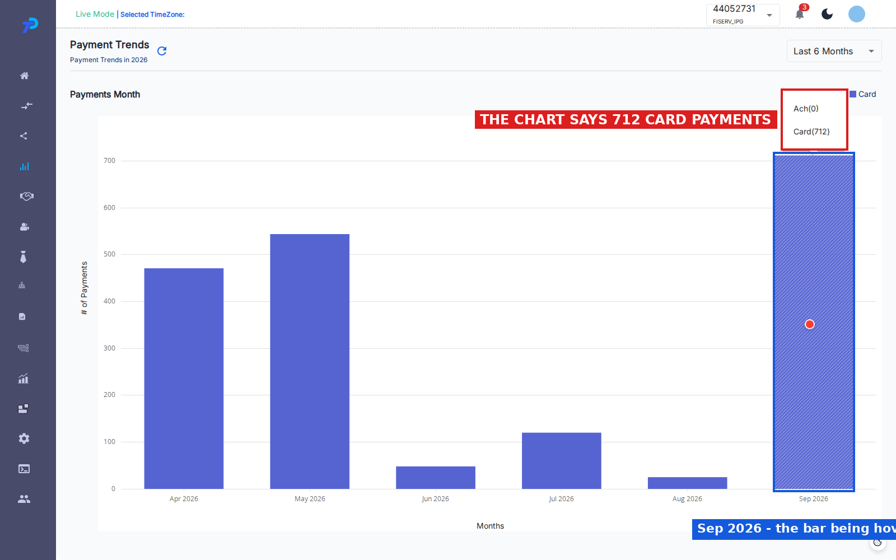
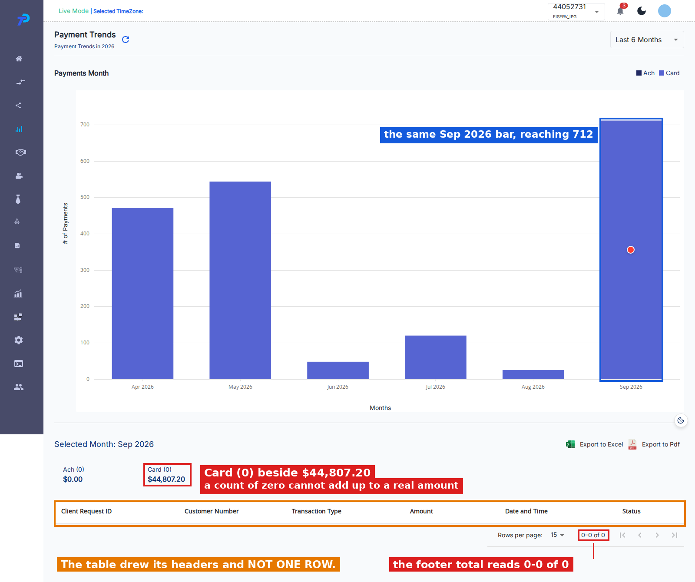

# Payment Trends — defects

**Module:** Payment Analytics → Payment Trends
**Environment:** QA — `https://qagps.tillipay.com/portal/paymenttrends`
**Scope:** everything found while covering PT-LOAD, PT-RANGE, PT-LEG and PT-TIP
**Last updated:** 28 September 2026

| | Test case | Defect | Priority | Gateways | Seen on 28 Sep |
|---|---|---|---|---|---|
| 1 | PT-LOAD-09 | The chart draws no month names at all | High | MerchantE, CommerceHub | yes |
| 2 | PT-NEG-12 | The chart counts payments the drill-down cannot find | Critical | IPG | yes |
| 3 | PT-NEG-13 | A summary card reads zero beside a real amount | High | IPG | yes |
| 4 | PT-TIP-04 | The tooltip and the summary cards disagree | High | IPG | yes |
| 5 | PT-NEG-01 | A failure tells the merchant nothing | High | all gateways | yes |
| 6 | PT-NEG-05 | The value axis falls back to a fixed 0-300 scale | Medium | MerchantE, CommerceHub | yes |
| 7 | PT-NEG-11 | The legend falls back to another gateway's layout | High | MerchantE | **no — see section 7** |

Defects 2, 3 and 4 are one fault seen from three angles. Fixing 2 should close all three.

Defects 1, 5 and 6 are also one fault. A single unhandled error stops the chart being built,
and what is left on screen is a blank axis, a default scale and no explanation.

Every figure and screenshot in this document was captured on **28 September 2026** against QA.
Where an earlier note in the test-case sheet disagrees with what was measured, the earlier note
is wrong and is corrected in place.

A closing section lists three things that look like defects and are not, so they are not raised
again.

---

# 1. PT-LOAD-09 — the chart draws no month names at all

**Test case:** PT-LOAD-09
**Priority:** High
**Gateways seen on:** MerchantE and CommerceHub
**Date observed:** 24, 25 and 28 September 2026

## Summary

The Payment Trends chart should always be labelled. Whatever the merchant's data, the bottom
of the chart names the months being shown, so the merchant knows what period they are looking
at.

On two accounts it draws nothing. The heading renders, the value axis renders, both captions
render, and the bottom of the chart is blank. Nothing says anything is missing.

## Steps to reproduce

1. Sign in as the MerchantE merchant.
2. Go to **Payment Analytics → Payment Trends** from the sidebar.
3. Wait for the page to finish loading.
4. Read along the bottom edge of the chart, where the month names belong.
5. Repeat as the CommerceHub merchant.

## Expected result

Six month names are drawn along the bottom, oldest on the left through to the current month on
the right, exactly as on every other account.

## Actual result

No month names on either account. The rest of the chart frame renders normally.



The strip where the months belong is empty. Note that the **Months** caption underneath it does
render, the legend is correct, and the gateway resolved — so this is not a page that failed to
load.

CommerceHub shows exactly the same thing, and it is the account that rules out the obvious
explanation:



For contrast, the same page on BillPay:



## What pins the cause

Two earlier explanations were recorded and **both are wrong**. It is worth saying so plainly so
they are not chased again:

- *"The merchant is empty."* No. CommerceHub has 35 payments in the range and still draws nothing.
- *"The response is short."* No. Both accounts return six monthly entries, the same as the
  working ones.

The response was captured on all five accounts on 28 September. The difference is the **shape**
of the payload, not its size:

| Account | `data.data` | Month names |
|---|---|---|
| BillPay | `[array(6), array(6)]` | 6 |
| SnapPay | `[array(6), array(6)]` | 6 |
| IPG | six entries, a different shape | 6 |
| **MerchantE** | **`[array(6), null]`** | **none** |
| **CommerceHub** | **`[array(6), null]`** | **none** |

The rule is exact. Where the payload is a two-element array whose **second element is `null`**,
the chart draws no months. Every other shape draws six.

The code that breaks on it is in `PaymentTrends/index.js`, lines 506-510:

```
if (response?.data.data.data.length === 2) {
  const arr1Raw = response?.data.data.data[0];
  const arr2Raw = response?.data.data.data[1];        // null on these two accounts
  const hasMonthField = arr1Raw.some(e => e && e.month);
  const arr1 = arr1Raw.filter(e => e && Object.keys(e).length > 0);
  const arr2 = arr2Raw.filter(e => e && Object.keys(e).length > 0);   // throws
}
```

The payload having two elements is taken as proof that both are arrays. The second one is
`null`, `.filter()` is called on it, and that throws.

The throw happens **before** the chart's data is ever set, so `setmonthStateData` at line 567 is
never reached and the chart is left with nothing to label. The error is then caught by the
handler described in defect 5, which does nothing with it — which is why the page looks calm
while being broken.

## Impact

The merchant sees a chart they cannot read. Bars can be drawn with nothing to say which month
each belongs to, so the page cannot do the one thing it exists for. Because there is no error
message, it reads as a rendering glitch rather than as a failure, and it hid inside the test
suite for weeks for the same reason.

## Notes for the developer

Two independent fixes, and both are worth doing:

1. **Guard the payload shape.** Check the second element is an array before calling `.filter()`
   on it. `Array.isArray(arr2Raw) ? arr2Raw.filter(...) : []` is enough to stop the throw.
2. **Draw the axis from the month list the page already computes.** That list is built from the
   selected range, is always correct, and is what the working accounts end up displaying. Using
   it directly would make the chart label itself whatever the response contains.

Fixing only the first stops the crash. Fixing the second as well means a future payload problem
degrades into a chart with no bars rather than a chart with no axis.

## How to tell it is fixed

Open Payment Trends as MerchantE and as CommerceHub. Both should draw six month names ending at
the current month, with or without bars above them.

The automated test is `PT-LOAD-09` in `payment-analytics.spec.ts`. It runs on MerchantE and is
marked expected-fail, so it turns red the day this is fixed — that red is the signal to remove
the mark.

---

# 2. PT-NEG-12 — the chart counts payments the drill-down cannot find

**Test case:** PT-NEG-12
**Priority:** Critical
**Gateways seen on:** IPG
**Date observed:** 14 and 28 September 2026

## Summary

Hovering a month shows how many payments it holds. Clicking that month opens a drill-down that
should list those same payments.

On IPG the two disagree completely. The chart reports hundreds of card payments for a month;
clicking it returns an empty table.

## Steps to reproduce

1. Sign in as the IPG merchant.
2. Go to **Payment Analytics → Payment Trends**.
3. Hover a month bar and read the Card count from the tooltip.
4. Click that same bar.
5. Scroll below the chart to the transaction table.
6. Count the rows, and read the record total in the table's footer.
7. Compare that total against the tooltip count from step 3.

## Expected result

The drill-down lists the payments the chart counted. The footer total matches the tooltip.

## Actual result

Captured on 28 September. Hovering the September 2026 bar:



Clicking that same bar:



The chart says **712 card payments**. The table returns **no rows** and a record total of
**0-0 of 0**.

The same thing was recorded on 14 September for a different month — the tooltip read Card (544)
for May 2026 and the drill-down returned nothing — so this is not specific to one month.

## Evidence that the filter is not the cause

Querying the transactions endpoint directly for the same merchant **with no filter at all** also
returned zero records. So this is not the month filter excluding rows. There is nothing for that
merchant to return.

The two sources genuinely disagree: the figures behind the chart and the figures behind the
transaction list are not describing the same data.

## Impact

Critical. The merchant is shown a number they cannot act on. The chart says 712 card payments
were taken; clicking through to see them shows an empty table with no explanation. Either the
chart is overstating or the list is missing records, and until that is settled neither figure on
this page can be trusted for IPG.

It also drives defects 3 and 4, which should close when this one does.

## Notes for the developer

Settle first which of the two is right — whether those 712 payments exist. The chart's figures
come from the periodic stats call; the drill-down's come from the transactions call. Whichever
is wrong, the fix belongs on that side rather than in the page.

## How to tell it is fixed

Hover any month on IPG, note the Card count, click it, and confirm the footer total matches.

---

# 3. PT-NEG-13 — a summary card reads zero beside a real amount

**Test case:** PT-NEG-13
**Priority:** High
**Gateways seen on:** IPG
**Date observed:** 14 and 28 September 2026

## Summary

Clicking a month opens a row of summary cards, one per payment type. Each carries a count in
brackets and an amount below it.

On IPG the Card card reads **Card (0)** with **$44,807.20** beneath it. Zero payments cannot add
up to a positive amount, so the card contradicts itself.

## Steps to reproduce

1. Sign in as the IPG merchant.
2. Go to **Payment Analytics → Payment Trends**.
3. Click any month bar.
4. Read the count in brackets on the Card summary card.
5. Read the currency amount on that same card.

## Expected result

The count and the amount agree. A card showing an amount also shows how many payments made it up.

## Actual result

`Card (0)` above `$44,807.20`. Marked in red in the screenshot in defect 2.

On BillPay, whose drill-down does return rows, the same cards are consistent — Ach (43) and
Card (80), each beside a matching amount. The fault only appears where the drill-down comes back
empty.

## What pins the cause

The two halves of the card come from different places. The **amount** comes from the stats
response, which has the figures. The **count** is derived from the transaction list, which on IPG
returns nothing — so the count collapses to zero while the amount survives.

That is why this only appears where defect 2 appears.

## Impact

The merchant sees a self-contradictory figure. It is the most visible symptom of defect 2 and the
one most likely to be reported, since it is wrong on its face without anything to compare it to.

## How to tell it is fixed

Click any month on IPG. Every summary card showing an amount should show a matching non-zero count.

---

# 4. PT-TIP-04 — the tooltip and the summary cards disagree

**Test case:** PT-TIP-04
**Priority:** High
**Gateways seen on:** IPG
**Date observed:** 25 and 28 September 2026

## Summary

The tooltip on a month bar and the summary cards below the chart describe the same month, so
their counts should be identical. On IPG they are not.

## Steps to reproduce

1. Sign in as the IPG merchant.
2. Go to **Payment Analytics → Payment Trends**.
3. Hover a month bar and note every count in the tooltip.
4. Without moving to a different bar, click the one being hovered.
5. Read the counts in brackets on the summary cards.
6. Compare the two sets.

Hovering one bar and clicking another compares two different months, so the same bar has to be
used for both halves.

## Expected result

The counts are identical. They describe one month.

## Actual result

Measured by hovering and clicking the same bar on four accounts:

| Account | Tooltip | Summary cards | Agree |
|---|---|---|---|
| BillPay | Ach 43, Card 80 | Ach 43, Card 80 | yes |
| SnapPay | Token 19, Card 92 | Token 19, Card 92 | yes |
| Paymentus | Ach 29, Token 246, Card 63 | Ach 29, Token 246, Card 63 | yes |
| **IPG** | **Ach 0, Card 712** | **Ach 0, Card 0** | **no** |

The two IPG screenshots in defect 2 are the two halves of that last row.

## What pins the cause

This is defects 2 and 3 showing through, not a separate fault. The tooltip reads the chart's
figures; the cards read the transaction list. Where the drill-down returns rows the two agree, on
three accounts out of four.

It is recorded separately because it is the check that catches the problem without opening a
network tab — hover, click, compare.

## Impact

Same as defect 3. Listed on its own so the comparison is not lost if the other two are closed
individually.

## How to tell it is fixed

The automated test is `PT-TIP-04` in `payment-analytics.spec.ts`. It runs on all four accounts,
with IPG marked expected-fail. When IPG turns red, the mismatch is gone and the mark should be
removed.

---

# 5. PT-NEG-01 — a failure tells the merchant nothing

**Test case:** PT-NEG-01
**Priority:** High
**Gateways seen on:** all gateways
**Date observed:** 14 and 28 September 2026

## Summary

When something goes wrong while Payment Trends is loading, the page shows no error of any kind.
The loading indicator stops and an empty chart is left on screen.

A broken page and a genuinely quiet month look exactly the same.

## Steps to reproduce

1. Sign in as the MerchantE merchant, where defect 1 currently triggers this on every load.
   Alternatively, block `periodic_payment_stats_us` in the browser's network tools on any account.
2. Go to **Payment Analytics → Payment Trends**.
3. Watch the page as it loads.
4. Look for any error message, banner or notification.

## Expected result

The merchant is told the figures could not be loaded, so they know not to read the empty chart as
real.

## Actual result

Nothing is shown. No banner, no notification, no inline message. The screenshot in defect 1 is
this defect as well — that page is mid-failure and says nothing about it.

## What pins the cause

The failure is caught and then discarded. The handler the page calls, `checkErroStatus` in
`utils/commonFunctions.js:203`, acts on only three error codes:

- **167** — redirects to the no-users-assigned page
- **401** and **484** — clears storage and returns to sign-in

Anything else falls through the function and returns having done nothing. No message is raised
and no state is changed.

This is not limited to HTTP errors. The handler sits on a `catch` that also receives ordinary
JavaScript errors, which is why the crash behind defect 1 disappears silently too.

**A correction to an earlier note.** This was first recorded against a `400 Merchant not exists`
response on MerchantE. That response no longer occurs — on 28 September MerchantE returned
**200**. The defect is unchanged and still reproduces every time, but the trigger today is the
unhandled error from defect 1 rather than an HTTP failure.

## Impact

A merchant whose data fails to load is shown an empty chart and left to assume it is their
figures. They may reasonably conclude they took no payments that period. Support cannot tell the
two cases apart from a screenshot either.

It also hides other faults during testing. A test that only checks the page renders will pass
against a broken load, which is exactly how defect 1 went unnoticed for several weeks.

## Notes for the developer

The pattern already exists elsewhere in the product — Payment Stats surfaces a message on the
same class of failure. Adding a default branch to `checkErroStatus`, or raising a message at the
call site, would cover every code and every error it does not already handle rather than only the
ones listed.

## How to tell it is fixed

Block the periodic stats call and open Payment Trends. A message should appear saying the figures
could not be loaded.

---

# 6. PT-NEG-05 — the value axis falls back to a fixed 0-300 scale

**Test case:** PT-NEG-05
**Priority:** Medium
**Gateways seen on:** MerchantE, CommerceHub
**Date observed:** 14 and 28 September 2026

## Summary

The scale down the left of the chart should fit the data being shown. On the accounts affected by
defect 1 it does not — it always runs 0 to 300 in steps of 20, whatever the merchant's volume.

## Steps to reproduce

1. Sign in as the MerchantE or CommerceHub merchant.
2. Go to **Payment Analytics → Payment Trends**.
3. Read the numbers down the left-hand side of the chart.

## Expected result

The top of the scale reflects the busiest month on screen.

## Actual result

The axis reads 0, 20, 40 … 300 on both accounts. It is marked in orange on the MerchantE
screenshot in defect 1.

By comparison, SnapPay — which has data and renders normally — scales to 60, and IPG scales to
just over 700. Those are correct. The 300 only appears where the chart failed to build.

## What pins the cause

The ceiling is computed from the chart's data as it is assembled. When the assembly throws, as it
does in defect 1, the computed value is never applied and the chart keeps a module-level default
of 300.

So this is not an independent fault: it is the visible remainder of defect 1. It is recorded on
its own because it was observed and logged separately, and because it gives a quick way to spot
the failure — a chart scaled to exactly 300 has not loaded properly.

## Impact

Low on its own. Any bars that do render are drawn against a scale that has nothing to do with the
data, so they look far smaller than they should. Its main value is as a symptom.

## How to tell it is fixed

Fix defect 1 and this should go with it. Open Payment Trends as MerchantE or CommerceHub and
confirm the axis no longer tops out at exactly 300.

---

# 7. PT-NEG-11 — the legend falls back to another gateway's layout

**Test case:** PT-NEG-11
**Priority:** High
**Gateways seen on:** MerchantE
**Date observed:** 14 September 2026
**Status on 28 September 2026: DID NOT REPRODUCE — see below**

## Summary

Payment Trends draws a different set of series depending on the merchant's gateway. Some show ACH
and Card; others show Token and Card.

When the gateway cannot be determined, the page does not say so — it silently draws the ACH
layout. A Token-gateway merchant is then shown a chart shaped for a different kind of account.

## What was originally observed

On 14 September, MerchantE rendered the legend **Ach** and **Card** while the portal header
plainly read MerchantE. Its periodic call was returning 400 at the time, so the gateway never
resolved.

## What was measured on 28 September

**It no longer reproduces.** MerchantE's call now returns 200 and carries
`"payment_gateway":"MERCHANT_E"`, the gateway resolves, and the legend renders **Token** and
**Card** — correctly. This is visible in the MerchantE screenshot in defect 1, marked in green.

The original observation is not withdrawn. It was real, and the code path that produced it is
still there — it simply cannot be reached at the moment because the call it depended on has
started succeeding.

## What pins the cause — still live in the code

In `PaymentTrends/index.js`:

- line 357 — `const [gateWay, setGateWay] = useState("")`
- line 489 — `setGateWay(response?.data.data.payment_gateway)`

The gateway is only set once the call has succeeded. When it fails, the value stays the empty
string it started as. Every later check compares against a specific gateway name —
`gateWay === "SNAP_PAY"`, `gateWay === "MERCHANT_E"` and so on — so an empty value fails all of
them and the code falls through to the ACH and Card default.

The empty string is treated as a real answer rather than as "not known yet". That is unchanged.

## How to confirm it is still a defect

Block `periodic_payment_stats_us` in the browser's network tools and open Payment Trends as
MerchantE, SnapPay or CommerceHub. If the legend shows Ach and Card, the defect is live. This
should be done before the ticket is either fixed or closed.

## Impact

The legend, the bars and the summary cards all key off the same unresolved value, so a failed call
does not just lose the data — it redraws the page as a different kind of account, with nothing to
say so.

## Notes for the developer

Holding the gateway as unknown until it is actually known, and rendering nothing rather than a
default while it is, would stop the page asserting something untrue. Pairing that with defect 5
covers the case properly: say the load failed, and do not draw a chart shaped for the wrong
account in the meantime.

---

# Reviewed and closed — not defects

These three were raised or recorded as defects and have since been reviewed and closed. They
are listed so they are not raised again.

## PT-LOAD-10 — the right-hand value axis never renders

The chart declares two value axes but binds every series to the left one, so the right-hand
axis never appears. Its fixed 0-110 range and currency label are configuration that does
nothing.

**Closed on 25 September 2026.** It is unfinished setup rather than a fault, and the amounts
that axis would have carried are already one click away — clicking a month opens a panel
showing the count and the amount for each payment type.

## PT-LOAD-11 — the axis labels carry no ' k' or ' $' suffix

The label factory takes a symbol and never applies it, so every tick is drawn as a plain
number.

**Closed on 25 September 2026.** Applying the suffix would make the chart wrong. The left axis
counts payments, so a month with 20 payments would draw a tick reading `20 k` — twenty
thousand. The only real effect of leaving it is that a very high-volume merchant reads `50000`
rather than `50 k`: long, but correct.

## PT-NEG-09 — drill-down rows show an unexpected status

On BillPay the drill-down filters on one field while the Status column displays a different
one, so rows can legitimately show values such as `TIMEOUT_REFUND_FAILED` under a filter for
authorised payments.

**Not a defect.** The two fields are different by design. This is recorded because the rows
look wrong at a glance and have been raised before.
